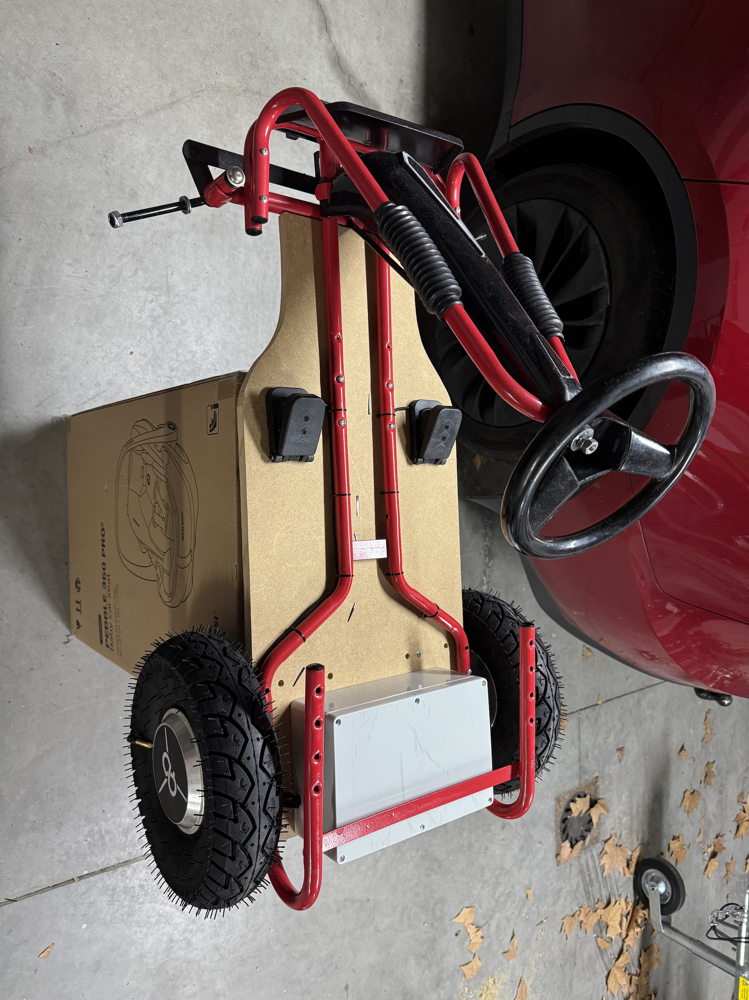
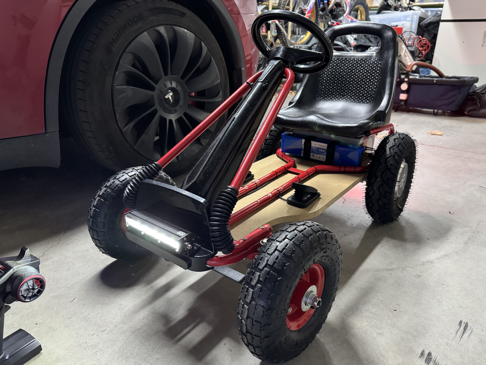

> Este artículo también está [disponible en Español]() 🇪🇸

As a child, I always dreamed of having vehicles that I could drive myself. I remember putting a chair with a fan in front of it and pretending to fly an airplane.

## The Plan

Now that my son is about to turn 3, I thought I could do something similar for him. I came up with the idea of transforming a boring pedal go-kart into an incredibly powerful and dangerous, and therefore, super fun electric car.

## Requirements

Before starting the project, I defined a series of basic requirements:

- **Motor:** It has to be powered by an electric motor, because we no longer live in 1940.
- **Size:** It has to be small, so it's easy to drive and fits in the trunk for transportation.
- **Power:** There are many models of electric go-karts for children. A good example is those that can be rented at shopping centers. These, in addition to being of very poor quality, have very little power, very little final speed, and their controls are usually all-or-nothing, meaning you can't control speed or direction proportionally. They either accelerate or not.
- **Speed Limiter:** As it's a car for children, it has to be safe (within reason). For this, the car must have some means to limit the maximum speed it can reach. This speed can be set very low at first and increased as the child gains experience.
- **Driving Modes:** Continuing with safety measures, my idea is that the car should have 2 driving modes:
	- **Manual:** Speed, brakes, direction (forward or reverse), steering, and speed limiter are controlled by the driver themselves. This will be ideal when the child is a bit older and has some driving experience.
	- **Radio-controlled:** Speed, brakes, direction, and speed limiter are controlled with a radio like those used for radio-controlled cars. The steering control will remain manual (at least for now).
- **All-terrain:** Cars that can only go on asphalt are boring. Nothing better than going through dirt, stones, and mud on a difficult terrain. This kart has to have good ground clearance and be able to handle any obstacle.
- **Tires:** They have to be of the inflatable kind to counteract the lack of suspension. They are also necessary for the car to be all-terrain.

## Components
### The go-kart
The kart had to be the right size for children between 3 and 6 years old. After looking around, I found a used pedal go-kart in very good condition that would serve as the base structure for the project:

With this, I solved important things like the steering mechanism and the seat, in addition to the overall structure.

### The floor
The original pedal kart structure is quite flimsy and didn't have anywhere to attach the motors or support the pedals and feet. I decided to use a 16mm thick MDF wood base cut to a specific size and shape to fit the kart.
On this base, the motors, pedals, battery, and electronics box will be mounted. It will also give the car good rigidity.

### The motors
In the past, Hoverboards (another deadly trap for kids) became very popular. Today, the Hoverboard craze has passed, and most are abandoned, gathering dust. This means we can get them almost for free by buying them second-hand from some parent who's tired of tripping over them in their kids' bedroom.

A great advantage of these motors is that they fit inside the wheel, so they don't take up any space. The motor IS the wheel. You just add a tire and go.
Additionally, they are extremely powerful for their size. A Hoverboard can carry up to a 100 kg person uphill without issues.

### Motor controllers
The Hoverboard motors are brushless, and they have magnetic sensors to know the motor's position at all times. This allows for very good speed regulation. There are variants of these motors without sensors, but they don't work well at low speeds.

After searching a bit, I found a controller called [ZS-X11H](https://www.aliexpress.com/w/wholesale-ZS%2525252dX11H.html) that is incredibly cheap (costs about €12), especially compared to more decent controllers.

In addition to its price, it has the advantage of allowing you to change the direction of rotation, adjust the speed, and even has a braking function (more on this later). Additionally, their control inputs are analog by default, but by soldering a jumper, you can use PWM inputs. This will allow us to control them using an [Arduino Nano](https://store.arduino.cc/en-es/products/arduino-nano).

### The battery
The Hoverboard I took the motors from had a 36v battery, but it was very small and very dead. I wanted it to have plenty of autonomy, so I bought a 36v, 10Ah battery. With this, it should have enough autonomy for a while (I haven't checked how long yet, but in my short experience, it lasts a lot).

A problem with most batteries is that they get ruined if they are over-discharged. That's why I installed a discharge protection system that simply shuts off the kart when the battery voltage is too low:

And I also installed a small screen that shows the remaining charge and current voltage:

### Voltage converters
I said that the battery is 36 volts, but we also need 5v to power the Arduino and the RC receiver, and 12v for the lights.
For this, we use two voltage converters like this one:

### The wheels
As I mentioned earlier, I wanted the wheels to be inflatable to cushion the bumps a bit. The original pedal go-kart wheels were plastic, so in addition to being noisy, they were extremely hard.

For the front wheels, I bought the typical wheelbarrow wheels that come with a tire, tube, and bearings:

For the rear wheels, after researching a bit, I found that there's a tire size that's perfect for Hoverboard motors. The specific size is **4.10/3.50-5**. They're not cheap or easy to find, but luckily I got them on AliExpress.

With a rubber mallet and a bit of effort, I managed to put the tires on the motors. They fit perfectly. The only problem is that the motors don't have a hole for the air valve to come out, so I had to make a hole in the tire itself and take it out from there. It's not pretty, but I couldn't think of another solution:

### The Radio Control
I was looking for something cheap but functional. After reading a bit online, I found a very affordable model (around €20 with receiver included) that has 6 channels and many functions. It's the **HotRC CT-6A**:

Six channels are more than enough for the functionalities I want to control:
- Mode (manual or radio-controlled)
- Acceleration
- Braking
- Steering
- Speed limit

I use 5 of the 6 available channels, and one is left free in case I want to add steering control in the future.

### Lights
Every worthy car has to have lights. I installed a fairly powerful front white light and a rear red position light. Both turn on and off with a switch located behind the steering wheel.

### Pedals
For manual mode, I installed pedals that allow progressive acceleration and braking. I'm not sure what they were originally designed for, but they're exactly what I needed:

Something I added was keeping the brake functionality with the pedal, even if the car is in radio-controlled mode. This way, if the driver wants to brake at any moment for any reason, they can do so.

### Speed limiter
The kart's maximum speed can be limited using a potentiometer installed in the electronics box when the kart is in manual mode, or with a 3-position switch on the radio control for that mode.

### Direction control
In manual mode, the control for forward or reverse direction is a switch located behind the steering wheel. With it, you can select forward or reverse.
In radio-controlled mode, it's a button on the remote itself that's used to change direction.

The other switch you see in the photo is for the lights.

### The brain
As the car's main processor, I used an Arduino Nano. It's a very simple microcontroller, but the reality is that you don't need much more.

Its functions are:
- Define the driving mode
- Receive radio control commands
- Decode the current position of the pedals
- Define the direction of rotation of the motors
- Control the speed limit
- Send the output signal to the motor controllers

To learn more, see the source code section.

## Diagram
This is a simplified diagram I made of all the components that make up the car:

## Source code
The source code is based on Arduino using PlatformIO for development. It's open-source and can be found [here](https://github.com/mattogodoy/electric-go-kart).

## Integrating All Components
Here are some photos and videos of the entire process.

This is an early test of the motor controller. The battery hadn't arrived yet, so I was using a regulated power source for the test:

<video controls style="width: 100%;" src="/../assets/images/2025-03-21/videos/IMG_8270.mp4" title=""></video>

Here are some integration tests with the Arduino and the RC. The code has a debugging function that allows you to see the inputs and outputs on the computer screen:

<video controls style="width: 100%;" src="/../assets/images/2025-03-21/videos/IMG_8303.mp4" title=""></video>
<video controls style="width: 100%;" src="/../assets/images/2025-03-21/videos/IMG_8304.mp4" title=""></video>

This is the waterproof box that contains all the electronic components. It fits perfectly under the seat. Unfortunately, I forgot to take a photo with all the components inside:

Here is the installation of the rear motors. I was thinking about how to make an adapter to hold them, but it occurred to me that cutting the Hoverboard's original supports could be an easy and robust way:

Here you can see it's almost finished. I installed the pedal go-kart structure on the wooden floor and the front wheels:

These are the first tests with everything integrated:
<video controls style="width: 100%;" src="/../assets/images/2025-03-21/videos/IMG_8518.mp4" title=""></video>
<video controls style="width: 100%;" src="/../assets/images/2025-03-21/videos/IMG_8552.mp4" title=""></video>

And this is the final result:

<video controls style="width: 100%;" src="/../assets/images/2025-03-21/videos/IMG_8565.mp4#t=1" title=""></video>
<video controls style="width: 100%;" src="/../assets/images/2025-03-21/videos/IMG_8566.mp4" title=""></video>

## Pending tasks

### Steering control
One of the things I initially considered adding, but later discarded, is controlling the steering using the remote control. This functionality would be a full project in itself because it has a couple of aspects that are difficult to solve:
- The motor used to change direction needs to be very powerful. Sometimes turning the steering wheel requires a lot of force, and a model servo, no matter how large, wouldn't work. I've seen that for some robotics projects, windshield wiper motors are used, adapted with a potentiometer to turn them into super-powerful servos. This would be a good solution, but it requires a lot of work.
- The mechanism has to allow for both manual and radio-controlled steering. This is more difficult than it seems. Having the aforementioned motor installed would make it almost impossible to manually turn the wheels using the steering wheel, because this motor uses a gearbox. A solution could be to manually "engage" the radio-controlled system when needed, and "disengage" it when the driver is controlling the direction. This would require a lot of work and isn't a solution I particularly like.

Because of these problems, I decided that (for now) there will be no way to control the steering of the car using the remote control. However, it's a good way for the child to learn to drive on their own.

### Regenerative braking
I mentioned earlier that the motor controller I used for this project had a braking function. For this particular controller, that function is not progressive. That is, the brake can be activated or not. This isn't a big problem in itself, but the real problem is that when I first tested the car, I realized that the braking function of these controllers only serves to reduce the speed at which the wheels are turning, but they don't apply considerable force. In short, this means that the car currently HAS NO BRAKES.

The reason is that for the motors to brake, you have to change their mode and make them work as generators. This way, the motors offer resistance, but they generate energy, and that energy has to go somewhere. Ideally, back to the battery.
Decent motor controllers have this functionality, and it's called "regenerative braking." It's very good because you can recover some of the battery's energy during braking or when going downhill.

This explains why the controllers I used are so cheap; they don't have this functionality (among others). I've already ordered others that cost six times more but have many more features, including regenerative braking. I made the investment because they can be used later for other projects, but mainly so that the driver can brake, since this is already a deadly trap as it is.

### Loss of remote signal
This remote control has a signal loss feature. I need to investigate a bit more and implement it. I don't want it to happen that at some point, whether due to distance or any other reason, the signal from the remote control is lost and the child is trapped in a speeding kart with the accelerator stuck. This is another reason why I made sure the driver can always use the brake pedal in any mode.

---

That's all. See you next time!
