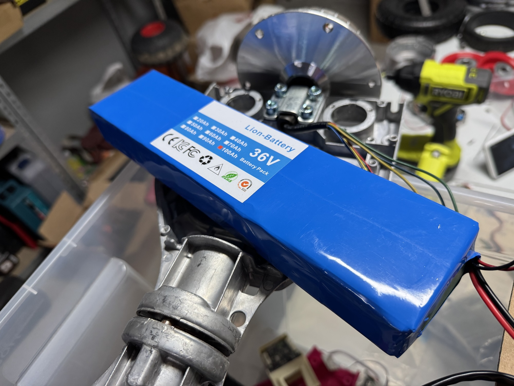
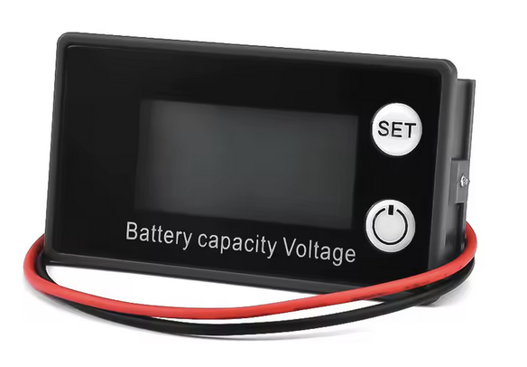
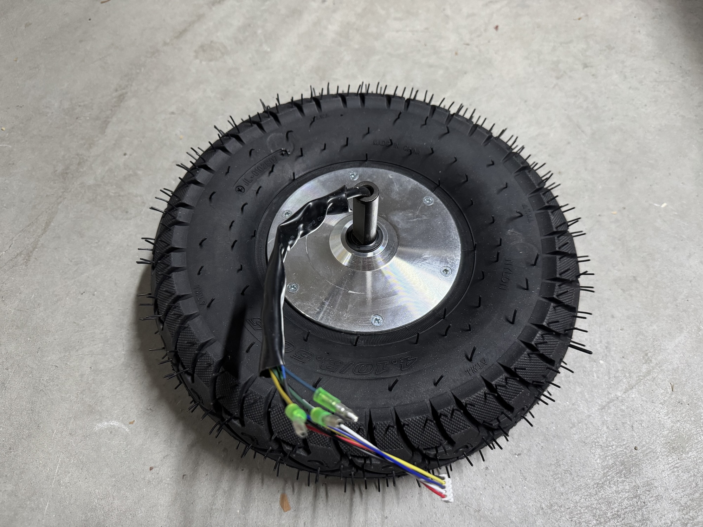
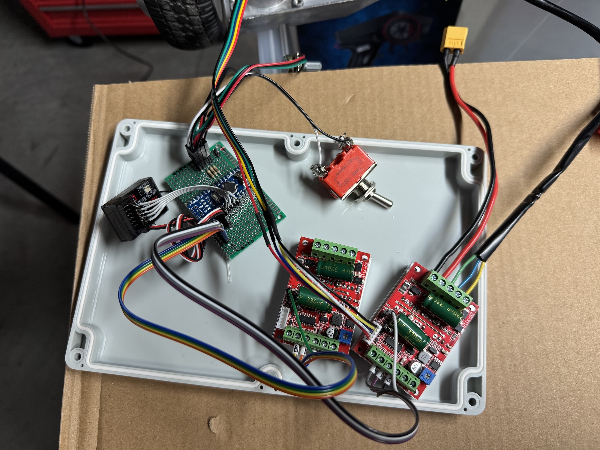
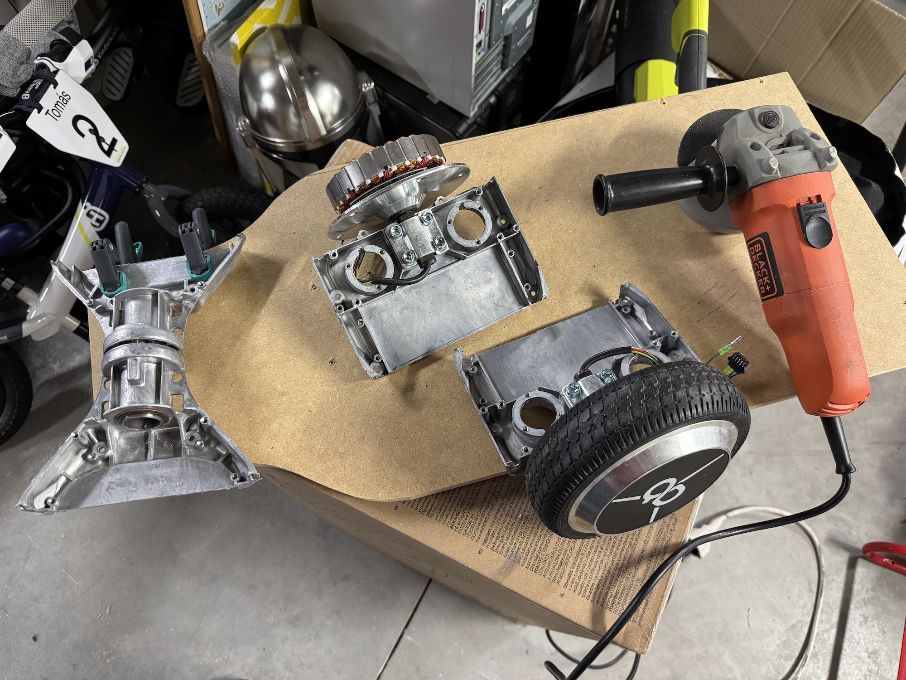
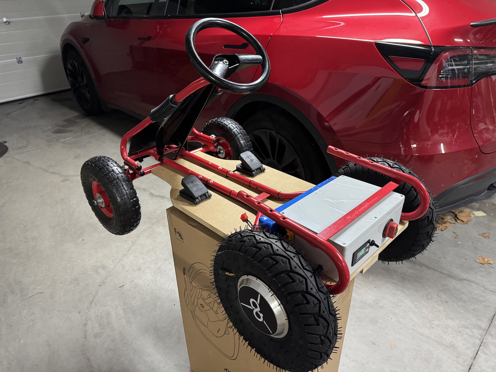
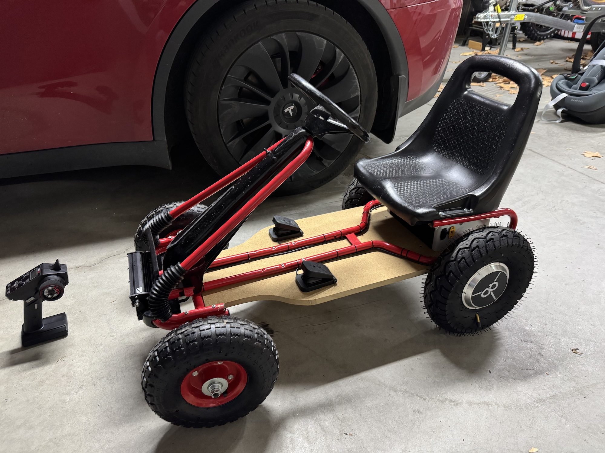
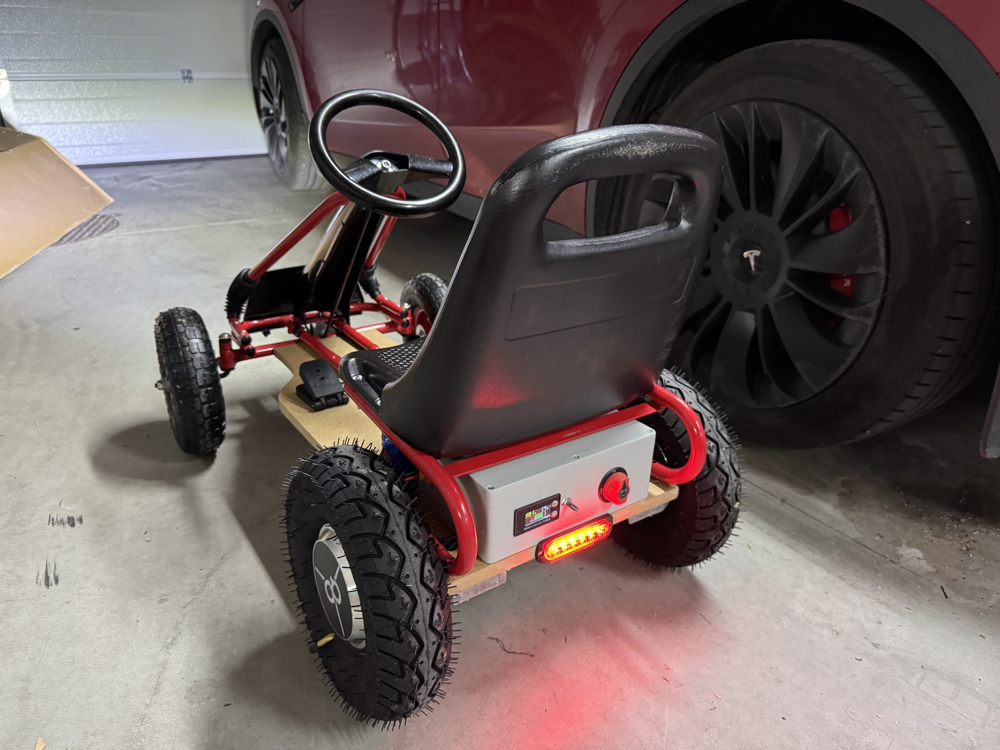
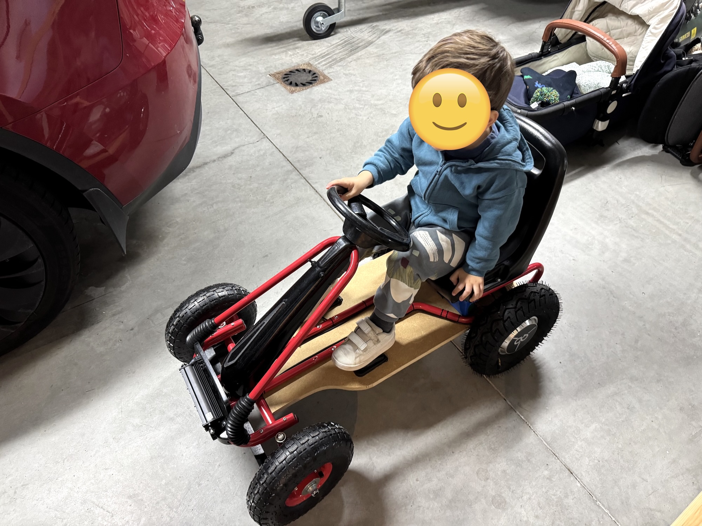

# Convirtiendo un coche a pedales en una trampa mortal

De pequeño siempre soñaba con tener vehículos que pudiera conducir yo mismo. Recuerdo poner una silla con un ventilador delante y jugar a que volaba en una avioneta.

## El plan

Ahora que mi hijo está cerca de cumplir 3 años, pensé que podría hacer algo del estilo para él. Se me ocurrió transformar un aburrido coche a pedales en un coche eléctrico increíblemente potente y peligroso, y por lo tanto, súper divertido.

## Requisitos

Antes de empezar con el proyecto definí una seria de requisitos básicos:

- **Motor:** Tiene que ser propulsado por un motor eléctrico, porque ya no vivimos en 1940.
- **Tamaño:** Tiene que ser pequeño, para que sea fácil de conducir y quepa dentro del maletero para poder transportarlo.
- **Potencia:** Existen muchos modelos de coches para niños. Un buen ejemplo son los que se pueden alquilar en los centros comerciales. Estos coches, además de ser de una calidad bastante mala, tienen muy poca fuerza, muy poca velocidad final, y además sus controles suelen ser todo-o-nada, es decir que no se puede controlar su velocidad o dirección de manera proporcional. Aceleran, o no.
- **Limitador de velocidad:** Al ser un coche para niños, tiene que ser seguro (dentro de lo que cabe). Para ello, el coche debe disponer de algún medio para limitar la velocidad máxima que puede alcanzar. Esta velocidad se puede poner muy baja al principio, e ir subiéndola en la medida en que el niño va ganando experiencia.
- **Modos de conducción:** Continuando con las medidas de seguridad, mi idea es que el coche tenga 2 modos de conducción:
	- **Manual:** La velocidad, los frenos, la marcha (adelante o reversa), la dirección de giro y el limitador de velocidad se controlan por el propio conductor. Esto será ideal para cuando el niño sea un poco más mayor y tenga algo de práctica en la conducción del coche.
	- **Radiocontrolada:** La velocidad, los frenos, la marcha y el limitador de velocidad se controlan con un mando a distancia del tipo de los que se usan para los coches a radiocontrol. El control de la dirección de giro seguirá siendo manual (al menos por ahora).
- **Todo terreno:** Los coches que sólo puede ir por el asfalto son aburridos. Nada mejor que ir por la tierra, las piedras y el barro por un terreno complicado. Este coche tiene que tener una buena altura libre al suelo y ser capaz de afrontar cualquier obstáculo.
- **Neumáticos:** Como su nombre lo indica, tienen que ser de los que llevan aire dentro para contrarrestar la falta de suspensión. Además, son necesarios para que el coche sea todo terreno.

## Componentes
### El coche
El coche tenía que ser de un tamaño adecuado para niños de entre 3 y 6 años. Luego de mirar un poco, di con un coche a pedales usado, pero en muy buen estado, que hará de estructura base para el proyecto:

Con esto ya soluciono cosas importantes como el mecanismo de la dirección y el asiento, además de la estructura general.

### La base
La estructura original de coche a pedales es bastante endeble y no tenía de dónde sujetar los motores ni donde apoyar los pies. Decidí entonces usar una base de madera MDF de 16mm de grosor cortada con un tamaño y forma específicos para que se adapte a la forma del coche.
Sobre esa base irán montados los motores, pedales, batería y caja de electrónica. Además dará buena rigidez al coche.

### Los motores
En una época se pusieron muy de moda los Hoverboard, otra trampa mortal para niños. Hoy en día, la locura de los Hoverboard ha pasado y en su mayoría están abandonados juntando polvo. Esto significa que podemos conseguirlos casi regalados al comprarlos de segunda mano a algún padre que esté harto de tropezarse con ellos al entrar a la habitación de sus hijos.

Una gran ventaja de estos motores es que van dentro de la rueda, por lo que no ocupan nada de espacio. El motor ES la rueda. Se le añade un neumático y a correr.
Además, son extremadamente potentes para su tamaño. Un Hoverboard puede llevar a una persona de hasta 100 kg cuesta arriba sin problemas.

### Controladores de motor
Los motores de Hoverboard son del tipo sin escobillas, y llevan unos sensores magnéticos para saber en qué posición se encuentra el motor en todo momento. Esto permite regular muy bien la velocidad del motor. Existen variantes de estos motores que no llevan sensores, pero no van muy bien a bajas velocidades.

Luego de buscar un poco di con un controlador llamado [ZS-X11H](https://www.aliexpress.com/w/wholesale-ZS%2525252dX11H.html) que es increíblemente barato (cuesta unos 12€), sobre todo comparado con controladores más decentes.

Además de su precio, tiene la ventaja de que permite cambiar la dirección de giro, ajustar la velocidad, e incluso una función de freno (más adelante hablaremos más de esto). Además, tienen la gran ventaja de que sus entradas de control son analógicas por defecto, pero soldando un jumper se pueden utilizar entradas [PWM](https://en.wikipedia.org/wiki/Pulse-width_modulation). Esto último nos permitirá controlarlos usando un [Arduino Nano](https://store.arduino.cc/en-es/products/arduino-nano).

### La batería
El Hoverboard del que saqué los motores tenía una batería de 36v, pero era muy pequeña y estaba muerta. Yo quería que tuviese bastante autonomía, por lo que compré una batería de 36v y 10Ah. Con esto debería tener autonomía para rato (todavía no he comprobado cuanto, pero doy fe de que dura muchísimo).

Un problema que tienen la gran mayoría de baterías es que se arruinan si las descargamos de más. Por eso es que instalé un sistema de protección de descarga que directamente apaga el coche cuando el voltaje de la batería es muy bajo:

Y además instalé una pequeña pantalla que indica la carga restante y el voltaje actual:

### Conversores de voltaje
Hemos dicho que la batería es de 36 volts, pero necesitamos también 5v para alimentar el Arduino y el receptor de radiocontrol, y 12v para las luces.
Para ello usamos dos conversores de voltaje de este tipo:

### Las ruedas
Como mencioné antes, quería que las ruedas fuesen hinchables para amortiguar aunque sea un poco los golpes. Las ruedas originales del coche a pedales eran de plástico, por lo que además de ruidosas eran tremendamente duras.

Para las ruedas delanteras compré las típicas ruedas de carretilla que vienen hasta con su cámara, llanta y rodamientos:

Para las traseras, investigando un poco encontré que hay un tamaño de neumáticos que es perfecto para los motores de hoverboard. El tamaño en concreto es el **4.10/3.50-5**. No son baratas ni fáciles de conseguir, pero por suerte las conseguí en AliExpress.

Con un martillo de goma y un poco de esfuerzo, pude poner los neumáticos en los motores. Entraron perfecto. El único problema es que los motores no tienen hueco para que salga la válvula de aire de la cámara, por lo que tuve que hacer un hueco en el propio neumático y sacarla por ahí. No es muy bonito, pero no se me ocurrió otra alternativa:

### El mando de radiocontrol
Buscaba algo barato, pero que cumpla su función. Leyendo un poco por internet encontré un modelo muy barato (alrededor de 20€ con receptor incluido) que tiene 6 canales y muchísimas funciones. Es el **HotRC CT-6A**:

Seis canales son más que suficientes para las funcionalidades que quiero controlar:
- Modo (manual o radiocontrolado)
- Aceleración
- Freno
- Dirección
- Límite de velocidad

Uso 5 de los 6 canales disponibles, y queda uno libre por si en un futuro quisiera añadire control de dirección de giro de volante.

### Luces
Todo coche que se precie tiene que llevar luces. Instalé una luz blanca delantera bastante potente y una luz roja de posición en la parte trasera. Ambas se encienden y apagan con un switch ubicado detrás del volante.

### Pedales
Para el modo manual, instalé unos pedales que permiten acelerar y frenar progresivamente. No sé muy bien para qué fueron diseñados originalmente, pero son justo lo que yo necesitaba:

Algo que añadí es mantener la funcionalidad del freno con el pedal, incluso si el coche está en modo de conducción radiocontrolada. De esta manera, si el piloto quiere frenar en un momento dado por el motivo que sea, puede hacerlo.

### Limitador de velocidad
La velocidad máxima del coche se puede limitar usando un potenciómetro que está instalado en la caja de la electrónica cuando el coche está en modo manual, o con un switch de 3 posiciones que está en el mando de radiocontrol para ese modo.

### Control de marcha
En el modo manual, el control de marcha es un switch que se encuentra detrás del volante. Con él se puede seleccionar ir hacia adelante o marcha atrás.
En el modo radiocontrolado, es un botón en el propio mando el que se utiliza para cambiar de dirección.

El otro switch que se ve en la foto es el de las luces.

### El cerebro
Como procesador principal del coche utilicé un Arduino Nano. Es un microcontrolador muy sencillo, pero la realidad es que no se necesita mucho más.

Sus funciones son:
- Definir el modo de conducción
- Recibir comandos de radiocontrol
- Decodificar la posición actual de los pedales
- Definir la dirección de giro de los motores
- Controlar el límite de velocidad
- Enviar la señal de salida a los controladores de motor

Para saber más, mira la sección del código fuente.

## Diagrama
Este es un diagrama simplificado que he hecho de todos los componentes que forman el coche:

## Código fuente
El código fuente está basado en Arduino utilizando PlatformIO para su desarrollo. Es de código abierto y se encuentra [aquí](https://github.com/mattogodoy/electric-go-kart).

## Integrando todos los componentes
Aquí van algunas fotos y videos de todo el proceso.

Esta es una primera prueba del controlador de motor. La batería no había llegado todavía, por lo que estaba usando una fuente de energía regulable para la prueba:

<video controls src="../assets/images/2025-03-21/videos/IMG_8270.mp4" title=""></video>

Aquí ya empiezan las pruebas de integración con el Arduino y el mando a distancia. El código tiene una función de debugging que permite ver las entradas y salidas en la pantalla del ordenador:

<video controls src="../assets/images/2025-03-21/videos/IMG_8303.mp4" title=""></video>
<video controls src="../assets/images/2025-03-21/videos/IMG_8304.mp4" title=""></video>

Esta es la caja estanca que contiene todos los componentes electrónicos. Tiene el tamaño justo para entrar debajo del asiento. Lamentablemente olvidé hacer una foto con todos los componentes dentro:

Esta es la instalación de los motores traseros. Estuve pensando en cómo podía hacer un adaptador para sujetarlos, pero se me ocurrió que cortando los propios soportes del hoverboard podría ser una manera fácil y robusta:

Aquí se ve la parte final, cuando instalo la estructura del coche a pedales en la base de madera y las ruedas delanteras:

Estas son las primeras pruebas con todo integrado:
<video controls src="../assets/images/2025-03-21/videos/IMG_8518.mp4" title=""></video>
<video controls src="../assets/images/2025-03-21/videos/IMG_8552.mp4" title=""></video>

Y este es el resultado final:

<video controls src="../assets/images/2025-03-21/videos/IMG_8565.mp4" title=""></video>
<video controls src="../assets/images/2025-03-21/videos/IMG_8566.mp4" title=""></video>

## Cosas pendientes

### Dirección de giro
Una de las cosas que consideré añadir en un principio, pero que luego descarté, es el control de la dirección de giro (el volante) usando el mando de radiocontrol. Esta funcionalidad sería un proyecto completo en sí porque tiene un par de aspectos que son difíciles de solucionar:
- El motor que se use para cambiar de dirección tiene que ser muy potente. En algunas ocasiones girar el volante requiere de bastante fuerza, y un servo de modelismo, por muy grande que sea, no serviría. Estuve viendo que para algunos proyectos de robótica se utilizan motores de limpia parabrizas adaptados con un potenciómetro para transformarlos en servos super potentes. Esta sería una buena solución, pero lleva bastante trabajo.
- El mecanismo tiene que permitir que se puedan usar las dos cosas: un volante manual, y el de radiocontrol. Esto es más difícil de lo que parece. Teniendo el motor antes mencionado instalado haría casi imposible girar las ruedas de forma manual usando el volante, porque este motor utiliza una caja reductora. Una solución podría ser poder "enganchar" manualmente el sistema radiocontrolado cuando sea necesario, y "desengancharlo" cuando sea el piloto quien vaya a llevar el control de la dirección. Esto llevaría bastante trabajo y es no es una solución que me guste especialmente.

Por estos problemas es que decidí que (por ahora) no habrá manera de controlar la dirección de giro del coche usando el mando a distancia. De todas maneras, viene bien que el niño vaya aprendiendo a conducir por sí mismo.

### Freno regenerativo
Antes he mencionado que el controlador de los motores que he usado para este proyecto tenía una función de freno. Para este controlador en particular, esa función no es progresiva. Es decir, el freno se puede activar o no. Esto no es un gran problema de por sí, pero el problema real es que cuando probé el coche por primera vez me di cuenta de que la función de freno de estos controladores sirve sólo para reducir la velocidad a la que van las ruedas cuando están girando, pero no aplican una fuerza considerable. En pocas palabras, esto significa que el coche actualmente NO TIENE FRENOS.

El motivo es que para que los motores puedan frenar, hay que cambiar su modo y funcionar como generadores. De esta manera, los motores ofrecen resistencia, pero al girarlos generan energía, y esa energía tiene que ir a parar a algún lado. Idealmente a la batería.
Los controladores de motor decentes tienen esta funcionalidad, y se llama "freno regenerativo". Es muy bueno porque se puede recuperar parte de la energía de la batería durante la frenada, o en una cuesta abajo.

Esto explica un poco el por qué del precio tan bajo de los controladores que he usado, que no disponen de esta funcionalidad (entre otras). Ya he encargado otros que cuestan 6 veces más, pero que tienen muchísimas más funciones, incluido el freno regenerativo. He hecho la inversión porque se pueden utilizar luego para otros proyectos, pero sobre todo para poder frenar, que ya de por sí esto es una trampa mortal, lo único que le faltaba es no tener frenos.

### Pérdida de señal del mando
Este mando de radiocontrol tiene una funcionalidad de pérdida de señal. Tengo que investigar un poco más e implementarla. No quiero que suceda que en algún momento dado ya sea por distancia o cualquier otro motivo se pierda la señal del mando a distancia y el niño quede atrapado en un coche con el acelerador bloqueado. Este es otro de los motivos por el que he hecho que el piloto siempre pueda usar el pedal de freno.

Eso es todo. Hasta la próxima!
